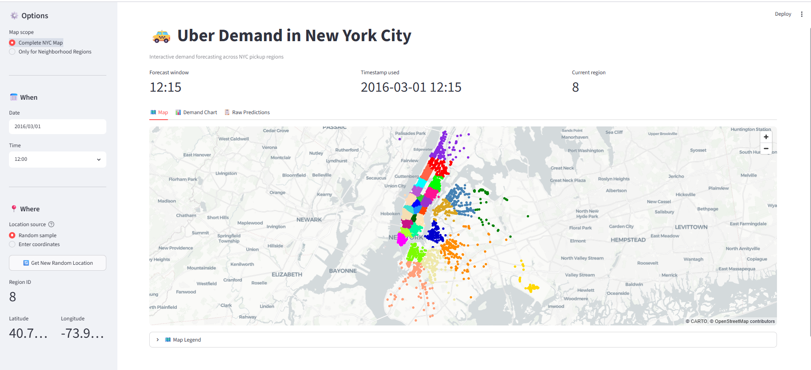
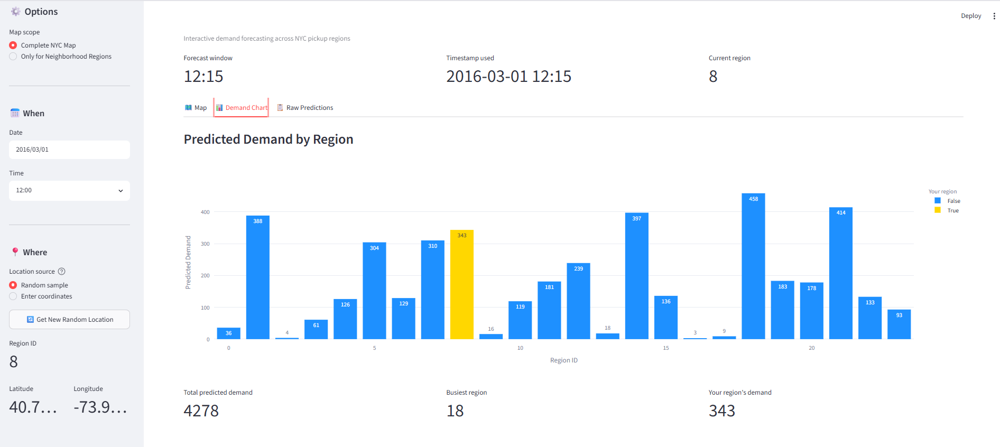
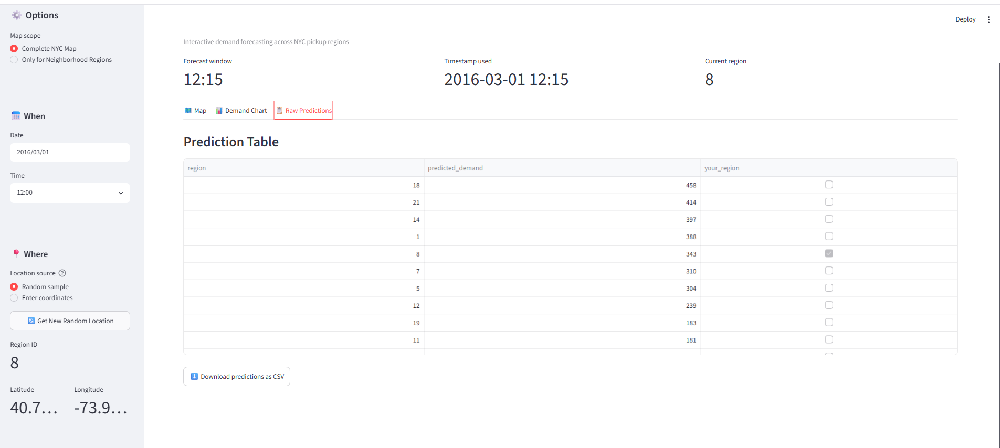

# 🚕 Uber Demand Prediction

> End-to-end MLOps project that forecasts Uber ride demand across New York City for upcoming time intervals, using a fully versioned and automated data → model → deployment pipeline.

---

## 📸 Screenshots

| Map View | Demand Chart | Raw Predictions |
|---|---|---|
|  |  |  |

---

## 1. Project Title & Description

**Uber Demand Prediction** forecasts short-term Uber cab demand across NYC pickup zones/clusters for upcoming time windows, so that supply (driver positioning) can be proactively matched to expected demand.

- **Repo:** [aditya14-sagar/Uber-Demand-Prediction](https://github.com/aditya14-sagar/Uber-Demand-Prediction)
- **Status:** Active development
- **Stack:** Python, scikit-learn, XGBoost, DVC, MLflow/DagsHub, Docker, GitHub Actions, Streamlit

---

## 2. Overview / Problem Statement

**Business problem:** Ride-hailing demand is highly non-uniform in time and space. If a platform can predict how many ride requests will originate from a given area in the next time interval, it can reposition idle drivers ahead of demand spikes, cut rider wait times, and reduce driver idle time.

**ML problem:** This is framed as a **regression/forecasting problem** — predicting the number of pickups for a given geographic cluster and future time bucket, based on historical pickup patterns.

**High-level approach:**
- Raw NYC Uber trip data is aggregated into fixed time intervals.
- **MiniBatch KMeans clustering** is used to bucket pickup coordinates into geographic zones (a common technique for demand forecasting when fine-grained geo-coordinates are too sparse to model directly).
- Time-series features (e.g. **EWMA — exponentially weighted moving average** — smoothing) are engineered per cluster/time-bucket.
- A supervised model (**XGBoost** / scikit-learn based regressor) is trained to predict demand for the next interval.
- Experiments and model artifacts are tracked via **MLflow** (hosted through **DagsHub**), and the winning model is promoted through a registry step.
- Predictions are served through a **Streamlit** app, containerized with **Docker**.

---

## 3. Architecture / Pipeline Diagram

```
Raw Trip Data
     │
     ▼
┌─────────────────┐
│ Data Ingestion   │  src/data/data_ingestion.py
└────────┬─────────┘
         ▼
┌─────────────────────────┐
│ Feature Extraction       │  src/features/extract_features.py
│ - MiniBatchKMeans        │  → models/mb_kmeans.joblib
│ - Scaler                 │  → models/scaler.joblib
│ - EWMA smoothing         │  → data/processed/resampled_data.csv
└────────┬─────────────────┘
         ▼
┌─────────────────────────┐
│ Feature Processing        │  src/features/feature_processing.py
│ - Train/test split        │  → data/processed/train.csv, test.csv
└────────┬─────────────────┘
         ▼
┌─────────────────────────┐
│ Model Building             │  src/model/model_building.py
│ - Encoder + regressor       │  → models/encoder.joblib, models/model.joblib
└────────┬─────────────────┘
         ▼
┌─────────────────────────┐
│ Model Evaluation            │  src/model/model_evaluation.py
│ - Metrics → run_information.json
└────────┬─────────────────┘
         ▼
┌─────────────────────────┐
│ Model Registration          │  src/model/register_model.py
│ - Push to MLflow/DagsHub registry
└────────┬─────────────────┘
         ▼
┌─────────────────────────┐
│ Serving (Streamlit app)     │  app.py
│ - Containerized via Docker
└─────────────────────────┘
```

**Key tools/frameworks:**

| Concern | Tool |
|---|---|
| Pipeline orchestration | **DVC pipelines** (`dvc.yaml`, `dvc.lock`) |
| Data/artifact versioning | **DVC** + remote storage (S3-compatible, via `dvc-s3`) |
| Experiment tracking & model registry | **MLflow**, hosted via **DagsHub** |
| Modeling | **scikit-learn**, **XGBoost**, **Dask** (large-data handling) |
| Serving | **Streamlit**, **Plotly** |
| Containerization | **Docker** |
| CI/CD | **GitHub Actions** |
| Testing | **pytest**, `tox` |

---

## 4. Repository Structure

The project follows the [Cookiecutter Data Science](https://drivendata.github.io/cookiecutter-data-science/) layout:

```
├── LICENSE
├── Makefile                <- Commands like `make data` or `make train`
├── README.md
├── app.py                  <- Streamlit inference app
├── Dockerfile
├── dockerignore
├── dvc.yaml                <- DVC pipeline stage definitions
├── dvc.lock                <- DVC pipeline lock file (reproducibility)
├── params.yaml              <- Hyperparameters / pipeline configuration
├── requirements.txt          <- Runtime dependencies
├── requirements-docker.txt   <- Dependencies for the Docker image
├── setup.py                 <- Makes `src` pip-installable
├── test_environment.py
├── tox.ini
│
├── .dvc/                    <- DVC internal config / remote settings
├── data/
│   ├── raw/                 <- Original immutable data dump (DVC-tracked)
│   ├── interim/              <- Intermediate transformed data
│   └── processed/            <- Final datasets used for modeling
│
├── docs/                    <- Sphinx documentation project
├── notebooks/                <- Exploratory analysis notebooks
├── references/                <- Data dictionaries, manuals, explanatory docs
├── reports/
│   └── figures/               <- Generated plots/figures
│
├── models/                   <- Serialized model artifacts (scaler, kmeans, encoder, model)
│
├── src/
│   ├── data/
│   │   └── data_ingestion.py
│   ├── features/
│   │   ├── extract_features.py     <- Clustering + EWMA feature engineering
│   │   └── feature_processing.py   <- Train/test split
│   ├── model/
│   │   ├── model_building.py
│   │   ├── model_evaluation.py
│   │   └── register_model.py       <- Pushes model to MLflow registry
│   └── visualization/
│       └── visualize.py
│
└── tests/                     <- Unit / integration tests
```

---

## 5. Prerequisites

- **Python** 3.10+ (see `setup.py` / `requirements.txt` for pinned versions)
- **Docker** (for containerized runs)
- **DVC** with an S3-compatible remote (`dvc-s3`, `boto3`) — credentials for the configured remote storage
- **DagsHub** account/token (for MLflow experiment tracking & model registry) — or your own MLflow tracking server
- `make` (optional, for the provided `Makefile` shortcuts)

---

## 6. Installation / Setup

```bash
# 1. Clone the repository
git clone https://github.com/aditya14-sagar/Uber-Demand-Prediction.git
cd Uber-Demand-Prediction

# 2. Create and activate a virtual environment
python -m venv venv
source venv/bin/activate      # Windows: venv\Scripts\activate

# 3. Install dependencies
pip install -r requirements.txt

# 4. Install the project package itself (editable mode, so `src` is importable)
pip install -e .

# 5. Configure environment variables / secrets
# Create a .env file (or export in your shell) with, e.g.:
#   MLFLOW_TRACKING_URI=<your DagsHub/MLflow URI>
#   MLFLOW_TRACKING_USERNAME=<username>
#   MLFLOW_TRACKING_PASSWORD=<token>
#   AWS_ACCESS_KEY_ID=<for DVC S3 remote>
#   AWS_SECRET_ACCESS_KEY=<for DVC S3 remote>

# 6. Pull DVC-tracked data & model artifacts
dvc pull
```

---

## 7. Data

- **Source:** Historical NYC Uber trip/pickup records (raw trip logs with timestamps and pickup coordinates).
- **Versioning:** Managed with **DVC**; raw, interim, and processed datasets live under `data/` and are tracked via `.dvc` pointer files rather than committed directly to Git. A remote (S3-compatible, configured via `dvc-s3`) stores the actual data/artifact blobs.
- **Schema / data dictionary:** See `references/` for data dictionaries and explanatory materials, and `docs/` for the generated project documentation.

To fetch the versioned data:
```bash
dvc pull
```

To see how data flows through the pipeline stages:
```bash
dvc dag
```

---

## 8. Usage

### Run the full pipeline
The pipeline is defined as DVC stages in `dvc.yaml`: `data_ingestion → extract_features → feature_processing → model_building → model_evaluation → register_model`.

```bash
# Reproduce the entire pipeline (only re-runs stages whose deps changed)
dvc repro
```

### Run an individual stage
```bash
python ./src/data/data_ingestion.py
python ./src/features/extract_features.py
python ./src/features/feature_processing.py
python ./src/model/model_building.py
python ./src/model/model_evaluation.py
python ./src/model/register_model.py
```

### Evaluation
`model_evaluation.py` writes metrics to `run_information.json` at the repo root — inspect that file (or the corresponding MLflow run) for the latest evaluation results.

### Inference / serving
The Streamlit app (`app.py`) loads the trained model/encoder/scaler artifacts and serves predictions interactively:
```bash
streamlit run app.py
```

### Docker
```bash
docker build -t uber-demand-prediction .
docker run -p 8501:8501 uber-demand-prediction
```

---

## 9. Model Registry & Versioning

- **Tracking/registry backend:** **MLflow**, hosted through **DagsHub** (see `mlflow` and `dagshub` in `requirements.txt`).
- **Registration step:** `src/model/register_model.py` consumes `run_information.json` (produced by the evaluation stage) and registers the corresponding run's model in the MLflow Model Registry.
- **Naming/versioning:** Each `dvc repro` run produces a new MLflow run tied to the current params/data hash (via DVC + MLflow autologging conventions); registered model versions increment automatically in the registry.
- **Promotion:** Promote a registered model version from *staging* to *production* through the MLflow/DagsHub UI (or MLflow's `transition_model_version_stage` API) once evaluation metrics clear your bar.

---

## 10. CI/CD

- **Trigger:** GitHub Actions workflows run on pushes/PRs to `main` (see the **Actions** tab of the repository for the exact workflow definitions and triggers).
- **Testing strategy:**
  - Unit/integration tests under `tests/`, run via `pytest`
  - Environment sanity check via `test_environment.py`
  - Multi-environment test matrix support via `tox.ini`
- **Pipeline validation:** `dvc repro` / `dvc pull` steps validate that the DVC pipeline and data remain reproducible in CI.
- **Deployment:** The `Dockerfile` builds a production image (using `requirements-docker.txt`) for deployment of the Streamlit inference app.

> If your CI workflow file lives at a different path than `.github/workflows/ci.yaml`, update the badge URL at the top of this README to match.

---

## 11. Monitoring & Observability

Not yet implemented as dedicated infrastructure in this repo. Recommended next steps if you extend this project:

- **Metrics to track:** feature/prediction drift between the training distribution and live traffic, inference latency, and accuracy decay over time (e.g. rolling MAE/RMSE vs. actuals).
- **Suggested tooling:** [Evidently](https://www.evidentlyai.com/) for drift reports, **Prometheus** + **Grafana** for latency/throughput dashboards, and MLflow's built-in run comparison for model-quality trends over time.

---

## 12. Infrastructure

- **Containerization:** `Dockerfile` (production) / `dockerignore` define the runtime image.
- **Data/artifact storage:** DVC remote (S3-compatible via `dvc-s3` + `boto3`).
- **Experiment/model backend:** DagsHub-hosted MLflow server.
- No IaC (Terraform/CloudFormation) templates are currently included in the repo — infrastructure (remote storage bucket, DagsHub project, deployment target) is expected to be provisioned/configured manually or added separately if you scale this out.

---

## 13. Testing

```bash
# Run the full test suite
pytest

# Run environment/setup sanity checks
python test_environment.py

# Run against the tox matrix (if configured for multiple Python versions)
tox
```

Tests live under `tests/`; add new tests alongside the pipeline stage they cover (ingestion, feature engineering, model building, evaluation).

---

## 14. Contributing

1. Fork the repo and create a feature branch: `git checkout -b feature/<short-description>`
2. Make your changes, keeping DVC stages in sync (`dvc repro` before committing if you touched pipeline code/data).
3. Run `pytest` locally and ensure it passes.
4. Commit with a clear, descriptive message and open a Pull Request against `main`.
5. Follow standard PEP 8 / repo linting conventions for Python code style.

---

## 15. Troubleshooting / FAQ

**`dvc pull` fails with a credentials error**
Make sure your S3-compatible remote credentials (`AWS_ACCESS_KEY_ID` / `AWS_SECRET_ACCESS_KEY`) are set, and that `dvc remote list` shows the expected remote.

**MLflow/DagsHub authentication errors during `register_model.py`**
Confirm `MLFLOW_TRACKING_URI`, `MLFLOW_TRACKING_USERNAME`, and `MLFLOW_TRACKING_PASSWORD` (a DagsHub token) are exported in your environment.

**`dvc repro` re-runs everything unexpectedly**
Check that `dvc.lock` is committed and up to date, and that no tracked dependency files (code, data, params) changed unintentionally.

**Streamlit app can't find model artifacts**
Run `dvc pull` first (or `dvc repro`) so `models/*.joblib` files are present locally before starting `app.py`.

---

Project scaffolding based on the [Cookiecutter Data Science](https://drivendata.github.io/cookiecutter-data-science/) template. `#cookiecutterdatascience`
